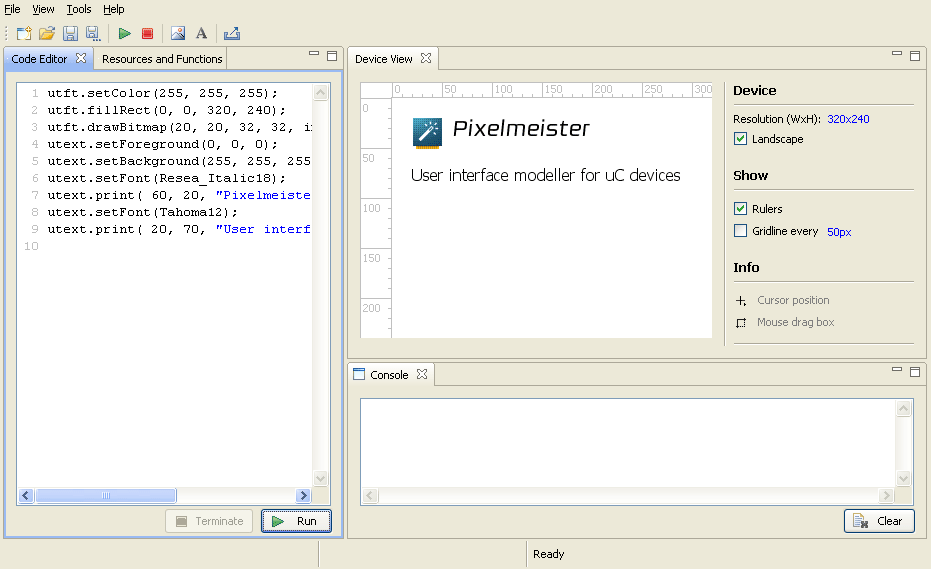
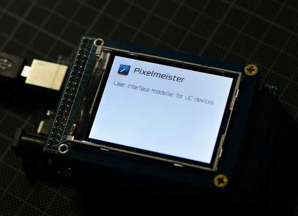
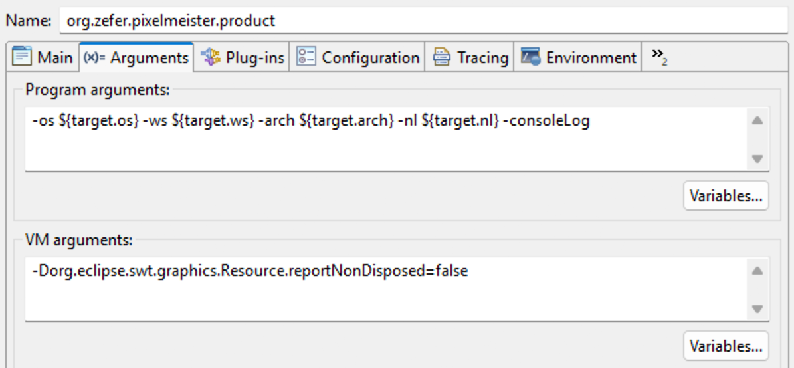

# Pixelmeister

`Pixelmeister` is a platform-independent tool designed to simplify the development of graphical user interfaces for microelectronic devices. It currently emulates the `Pixels` and `UTFT` graphics libraries (including `uText`).
`Pixelmeister` helps simulate user interfaces without the need to download and test the code on the target device after each UI customization step. This tool can also convert images, icons, and `TTF`/`OTF` fonts into a very compact format suitable for use in microcontroller programs.

In the context you can think of `UTFT` as an abstract graphics library that you can replace with minimal effort with any other suitable one. For example, `U8G2` for `ESP32`. All it requires is support for the drawing of vertical and horizontal lines of the selected color.





## Installation

It will take some time for the `Pixelmester` installer packagers and online update repository to be revived (at the moment, the task is not a priority).

Therefore, the current available installation method requires pre-installing the `Eclipse RCP` environment and downloading and running `Pixelmester` as a regular project.

- [Download Eclipse](https://www.eclipse.org/downloads/packages/release/2025-09/r)

- Checkout `Pixelmeister` to the directory of your choice:

```
cd ~/tools
git clone https://github.com/zxfr/Pixelmeister.git
```

- Run `Eclipse`, go menu `File`->`Open Projects from file system...` and select the just created `Pixelmeister` directory

- Right mouse click on the `Pixelmeister` root project directory (`org.zefer.pixelmeister`) in the `Project Explorer` pane and in the menu go to `Run as`->`Eclipse application`

- After the first run, you will see an exception in the console. Stop the application, go to `Run`->`Run configurations...` menu of `Eclipse` and select `org.zefer.pixelmeister.product`. Update VM argument `-Dorg.eclipse.swt.graphics.Resource.reportNonDisposed` value from `true` to `false`

 

Installation is complete now.

## Features

You can find a slightly updated `Arduino`-centric user guide [at this link](i/MANUAL.md). The ability to export a ready-to-compile Arduino sketch is probably not particularly useful these days, given the many alternative RAD tools available to developers that are superior to the annoying native Arduino IDE.

But the ability to copy generated and tested code snippets and imported resources and paste them into the RAD of your choice makes this tool a useful addition to any development environment.

## Tools

### Image import

[Read about the image import](i/IMAGES.md)

### True Type Font Import

[Read about the font import](i/FONTS.md)

## uText Library

The current state of the library can be found at [this link](https://github.com/zxfr/uText).

The library can be easily ported to any platform that supports horizontal and vertical line rendering.

### uText API

[Read about uText Library](i/MANUAL.md#utext)

