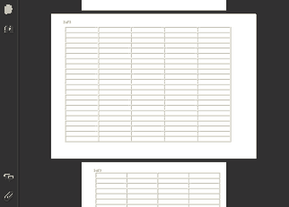
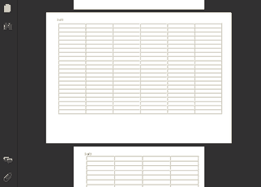

# Dynamic Page Format Changes Within a Document

A single page format and `htmlWidth` chosen for an entire document doesn't always suit every section of it equally well -- the textbook case is a wide table sitting among otherwise ordinary-width text. Scaling the whole document down by lowering `htmlWidth` is always an option, but it comes at a real cost: it shrinks _everything_, not just the section that actually needed the room, and it disproportionately lengthens ordinary text lines that have no block-level width constraint of their own, hurting readability throughout the document rather than only where the problem actually was. `<pd4ml:page.break>` offers a more targeted set of escape hatches instead, each suited to a different degree of "how much wider does this content actually need to be" -- from a simple orientation flip up to switching to an outright larger page format, applied only to the section that needs it and reset immediately afterward.


The `pageFormat` and `htmlWidth` attributes on `<pd4ml:page.break>` shown below are part of the **pre-v4 feature set**. As already noted on the [Usage Examples](https://app.gitbook.com/s/33dI66uC6sTAcaPjppX2/usage-examples) page's Apply Page Breaks entry, versions of PD4ML prior to v4 gave `<pd4ml:page.break>` several extra capabilities -- rotating the following page, adjusting the HTML-to-PDF scale factor, conditional breaks -- that hadn't yet been ported to v4 as of that writing. Confirm against the Javadoc/changelog for the PD4ML version actually in use before relying on this tag-attribute syntax under v4; the CSS-based and `setPageSize(...)`/`setPageMargins(...)` scope-string approaches covered in the [Programmer's Manual](https://app.gitbook.com/s/33dI66uC6sTAcaPjppX2/) (§7) are the current, version-independent way to vary page geometry across a document.


## 1. Rotate to landscape, then reset

The least invasive fix is a dynamic switch from portrait to landscape for just the wide section: it leaves the HTML-to-PDF scale factor completely untouched everywhere else in the document, since the extra horizontal room comes from the page's own reorientation rather than from scaling anything down. Once the wide content ends, a second `<pd4ml:page.break>` resets the format back to what it was.

```html
... main content ...
<pd4ml:page.break pageFormat="rotate">
... wide data ...
<pd4ml:page.break pageFormat="reset">
... main content (continued) ...
```



## 2. Rotate, plus a temporary htmlWidth increase

Sometimes the wide content is only a little wider than landscape orientation alone can accommodate. Temporarily raising `htmlWidth` just for that section adds a small additional scale-down on top of the rotation -- a modest, localized trade-off, rather than compromising the legibility of the whole document to fit one wide table. `htmlWidth="reset"` on the closing `<pd4ml:page.break>` restores the original value along with the page format.

```html
... main content, htmlWidth is 600 ...
<pd4ml:page.break pageFormat="rotate" htmlWidth="700">
... wide data ...
<pd4ml:page.break pageFormat="reset" htmlWidth="reset">
... main content (continued) ...
```



## 3. Switch to an outright larger page format

When the wide content is significantly wider than the main document layout -- wide enough that rotation and a modest `htmlWidth` bump both fall short -- the better fix is usually to reconsider how that content and data are organized in the first place, rather than continuing to chase it with page-geometry tricks. Where a larger page genuinely is the right answer, `pageFormat` accepts either a named larger format (`A3`, for instance) or explicit custom dimensions given in typographical points:

```html
<pd4ml:page.break pageFormat="A3">
...
<pd4ml:page.break pageFormat="2000x1000">
...
```

## Finding the right combination

In practice, arriving at a layout that reads well on screen and still prints legibly is usually a matter of experimenting with `pageFormat` and `htmlWidth` together for the specific section giving trouble, rather than expecting one fixed combination to work for every wide-content case a document might contain.

## See also

* [PD4ML page format output basics](https://old.pd4ml.com/cookbook/pdf_page_formatting.htm) -- background on page format conversion parameters referenced above.
* [Usage Examples](https://app.gitbook.com/s/33dI66uC6sTAcaPjppX2/usage-examples) -- the Apply Page Breaks entry covers the v3/v4 status of `<pd4ml:page.break>`'s extended attributes in more detail.
* [PD4ML Programmer's Manual](https://app.gitbook.com/s/33dI66uC6sTAcaPjppX2/) -- §7 covers the current, scope-string-based way to vary page size and margins across a document (`setPageSize(...)`/`setPageMargins(...)` with a `"1"`, `"2+"`, ... scope).
