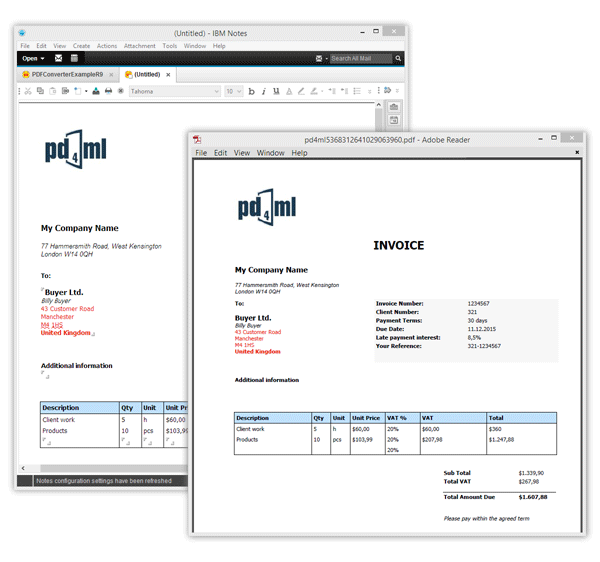
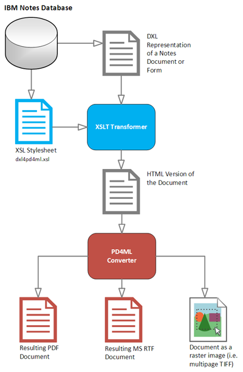

# PD4ML and IBM Notes/Domino

PD4ML can convert IBM Notes documents to PDF -- and, as elsewhere in PD4ML, to RTF or a raster image as well -- through several complementary approaches, depending on whether the source content is reachable over HTTP or only available as an offline export.


**This integration is supported on PD4ML v3 only.** The DXL-to-HTML XSLT machinery described below (`resources/dxl4pd4ml.xsl`) and the `Pd4Cmd -xsl notesdefault` flag that invokes it are, as of this check, still physically present in the current v4 codebase, and nothing in the source rules out them still functioning. That said, per current product guidance this integration path is only supported and exercised against v3 deployments -- so treat the sample code below, which accordingly uses the `org.zefer.pd4ml` v3 API, as the supported way to do this today rather than a stale artifact of an older page. If you're maintaining a Notes/Domino integration and need the v4 API specifically, that would be worth raising as its own question rather than assuming parity with what's shown here.


## Capturing documents online, over HTTP

The simplest approach captures the HTML that Notes Domino already returns over HTTP for a document, view, or form. Domino recognizes several URL patterns for this:

* `http://Host/Database/PageUNID?OpenPage`\
  (e.g. `http://www.acme.com/discussion.nsf/35AE8FBFA573336A852563D100741784?OpenPage`)
* `http://Host/Database/View/DocumentUniversalID?OpenDocument`\
  (e.g. `http://www.acme.com/leads.nsf/By+Rep/35AE8FBFA573336A852563D100741784?OpenDocument`)
* `http://Host/Database/FormUniversalID?ReadForm`\
  (e.g. `http://www.acme.com/products.nsf/625E6111C597A11B852563DD00724CC2?ReadForm`)

Any of these URLs can be handed directly to PD4ML's `render()` method:

```java
import java.io.FileOutputStream;
import java.net.URL;

import org.zefer.pd4ml.PD4ML;

PD4ML pd4ml = new PD4ML();
URL noteUrl = new URL("http://www.acme.com/discussion.nsf/35AE8FBFA573336A852563D100741784?OpenPage");

try (FileOutputStream out = new FileOutputStream("notesdoc.pdf")) {
	pd4ml.render(noteUrl, out);
}
```

For the full set of URL patterns Domino recognizes, see IBM's own [Domino URL syntax reference](http://www.ibm.com/developerworks/lotus/library/ls-Domino_URL_cheat_sheet/) (an older IBM developerWorks article -- if the link has moved or been retired since, searching for "Domino URL syntax cheat sheet" should turn up a current mirror).

If the Domino server itself runs a JSP infrastructure, PD4ML's JSP custom tag library is another way to trigger conversion online without shelling out to a separate process -- the tag library ships with the distribution (both a `javax.servlet`-based and a `jakarta.servlet`-based variant, for older and newer application servers respectively), though a dedicated walkthrough for the Notes/Domino case specifically hadn't been written yet as of the original article.

## Converting offline, from a DXL export

When an HTTP- or JSP-based online method isn't desirable -- for instance, when generation needs to run disconnected from the live Domino server -- PD4ML can instead convert a document's DXL export. DXL (Domino XML) is Domino's own XML representation of a database's structure and content: views, forms, and documents, in a form meant for import/export round-tripping.



Schematically, the conversion pipeline looks like this:



The DXL document is transformed to HTML by an XSLT stylesheet, and that HTML is then rendered to PDF by PD4ML exactly like any other HTML source. `Pd4Cmd` -- PD4ML's command-line tool -- drives the whole pipeline in one call:

```bash
java -Djava.awt.headless=true -Xmx512m -jar pd4ml.jar test.dxl 1200 -xsl notesdefault
```

A few notes on the parameters:

* `-Xmx512m` raises the JVM's heap limit to 512 MB; adjust it to fit the DXL documents you're converting.
* `-Djava.awt.headless=true` lets the process run on a non-graphical server, or over a remote SSH/Telnet session, on UNIX-derived platforms.
* `test.dxl` and `1200` are the DXL file location and the `htmlWidth` -- the virtual "browser" frame width, in pixels, that the intermediate HTML is laid out against.
* `-xsl notesdefault` selects the bundled default DXL-to-HTML stylesheet. In place of the `notesdefault` keyword, this flag also accepts a URI to an arbitrary external XSLT stylesheet, if the default transform doesn't suit a particular DXL structure.


On Windows, quote the DXL path with double quotes if it contains spaces; on UNIX-derived platforms, use single quotes.


By default, output uses A4 portrait format -- in the example above, the 1200px rendered width maps to A4's 595pt page width. If no output file path is given (via `-out`), the resulting PDF is written to STDOUT, which can be piped directly into another process.

## Choosing an implementation path

The two conversion approaches above can be wired together in two ways, depending on how much control you need over the DXL export step:

* **A single IBM Lotus Notes Java agent**, handling DXL export and PDF conversion together in one process, running inside Domino itself.
* **A two-step batch job**: an external process requests the DXL export, then hands it off to `Pd4Cmd` for conversion -- useful when the export and conversion steps need to run on different schedules or different machines.

## See also

* [Pd4Cmd Command-Line Reference](https://app.gitbook.com/s/33dI66uC6sTAcaPjppX2/pd4cmd-command-line-reference) -- the full, current flag reference for the `Pd4Cmd` invocation used above.
* [PD4ML v3 to v4 Migration Guide](https://app.gitbook.com/s/33dI66uC6sTAcaPjppX2/pd4ml-v3-to-v4-migration-guide) -- relevant background given this integration's current v3-only status.
* [PHP Wrapper](php-wrapper.md) -- the same "shell out to `Pd4Cmd`" pattern used here, applied to a PHP front end instead of a Notes/Domino one.
