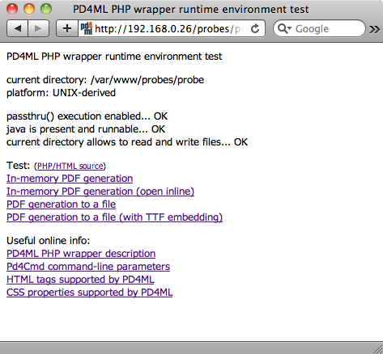

# PHP Wrapper

PD4ML is a pure-Java library, with no native PHP binding -- but since a Java Virtual Machine can be invoked as an ordinary external process, PHP can drive it perfectly well by shelling out to the [`Pd4Cmd`](https://pd4ml.com/pd4cmd-command-line-tool/) command-line tool and streaming its output straight back to the browser. This page walks through the reference wrapper package PD4ML publishes for exactly that pattern: a small set of PHP scripts, a couple of Perl/CGI fallbacks for restricted hosting environments, and a minimal "convert this page to PDF" button implemented from scratch. The only server-side prerequisite is a Java 1.4 or later runtime reachable from PHP's execution environment.

## Installation and environment test

The starting point is the [`pd4ml_php_wrapper.zip`](https://pd4ml.com/v3-eval/java/php/) archive, which bundles two PD4ML jar files alongside three directories:

* **`probe/`** -- an environment test script, plus demo documents and demo conversion scripts.
* **`fonts/`** -- a Chinese font file, used to demonstrate TrueType font embedding for non-Latin scripts.
* **`cgi-bin/`** -- Perl CGI scripts, for hosting environments whose PHP runtime configuration doesn't permit shelling out to Java at all (see [PHP configurations that disallow external processes](php-wrapper.md#php-configurations-that-disallow-external-processes) below).

Upload the unpacked archive contents to the server, and confirm the web server has read/write permissions on the target directory and that the directory is PHP-enabled. Assuming that directory is reachable at `http://myserver/pd4ml/`, opening `http://myserver/pd4ml/probe/index.php` runs the environment test; a successful run looks like this:



If any check fails, the probe script prints a specific suggestion for fixing it; once the minimum requirements are satisfied, it enables links through to the bundled demo conversion scripts.

### Customizing the demo scripts

The demo scripts expose four variables for adapting them to a given deployment:

| Variable      | Purpose                                                                                                                                                                                            |
| ------------- | -------------------------------------------------------------------------------------------------------------------------------------------------------------------------------------------------- |
| `$evaluation` | Switches between the trial jar (`pd4ml_demo.jar`) and the licensed one (`pd4ml.jar`). Set to `0` once a purchased `pd4ml.jar` is deployed.                                                         |
| `$jar`        | Location of the PD4ML jar(s). The demos default to `../pd4ml_demo.jar`, assuming the library sits one directory up.                                                                                |
| `$java`       | Path to the Java executable. Leaving it as `java` is enough when the server's `$PATH` already resolves it correctly; otherwise, point it at the interpreter directly (e.g. `/usr/local/bin/java`). |
| `$url`        | The URL of the document to convert to PDF.                                                                                                                                                         |

### PHP configurations that disallow external processes

A shared-hosting PHP configuration will sometimes disable the functions (`passthru`, `exec`, `shell_exec`, ...) needed to invoke Java as a subprocess at all. For exactly this situation, the wrapper package's `cgi-bin/` directory includes two Perl CGI scripts as a fallback: `probe.pl` mirrors the PHP environment test, and `pd4ml.pl` is a general-purpose converter that expects the source document's URL as a `url` HTTP parameter -- functionally equivalent to `pd4ml.php` in the walkthrough below.

Copy both scripts into the server's CGI-BIN directory, and make sure their file permissions allow execution -- mode `755` is the common default on UNIX-derived systems. Then update each script's `$jar` variable to point at the actual `pd4ml(_demo).jar` location, the same as for the PHP demo scripts above.

## Building an "As PDF" button from scratch

Rather than relying on the bundled demos, a minimal "convert the current page to PDF" button is only a few lines of PHP: a converter script that shells out to `Pd4Cmd`, a helper to reconstruct the current page's URL, and a form button that posts that URL to the converter.

The converter, `pd4ml.php`, reads the source URL from the POST body and streams `Pd4Cmd`'s PDF output directly back as the response:

```php
<?
  header("Pragma: cache");
  header("Expires: 0");
  header("Cache-control: private");

  if (array_key_exists('url', $_POST)) {

    header('Content-type: application/pdf');
    header('Content-disposition: inline');
    //header('Content-disposition: attachment; filename=test.pdf');

    // UNIX version
    passthru('java -Xmx512m -Djava.awt.headless=true ' .
      '-cp pd4ml_demo.jar Pd4Cmd \'' . $_POST['url'] . '\' 800 A4');

    // Windows version
    // passthru('java -Xmx512m ' .
    // ' -cp pd4ml_demo.jar Pd4Cmd \"' . $_POST['url'] . '\" 800 A4');

  } else {
    echo 'invalid usage';
  }
?>
```

`curPageURL()` reconstructs the URL of whatever page includes the button, so the same snippet can be dropped onto any page without hard-coding its address:

```php
<?php
// the function determines the current page URL
function curPageURL() {
  $pageURL = 'http';
  if ($_SERVER["HTTPS"] == "on") {
	$pageURL .= "s";
  }
  $pageURL .= "://";

  if ($_SERVER["SERVER_PORT"] != "80") {
    $pageURL .= "localhost:".$_SERVER["SERVER_PORT"].$_SERVER["REQUEST_URI"];
  } else {
    $pageURL .= "localhost".$_SERVER["REQUEST_URI"];
  }
  return $pageURL;
}
?>
```

And the button itself is an ordinary form posting to `pd4ml.php`:

```html
<!-- the button -->
<form action="pd4ml.php" method=post>
<input type=hidden value="<?php echo curPageURL(); ?>" name=url>
<input style="pd4ml-display: none; pd4ml-visibility: hidden"
    type=submit value="<b>Get the invoice as PDF</b>">
</form>
```

## Useful info

A handful of details are easy to miss when adapting this pattern to a real deployment:

* **Deployment footprint.** Copy `pd4ml.jar` (or `pd4ml_demo.jar` during evaluation), `ss_css2.jar`, and `pd4ml.php` itself into any PHP-enabled directory on the web server -- nothing else is required.
* **Hiding the button from the PDF.** The inline style `pd4ml-display: none; pd4ml-visibility: hidden` on the submit button is PD4ML-specific CSS that excludes the element from the converted PDF layout, so the button itself doesn't appear in its own output.
* **Multi-site hosting.** `curPageURL()` as shown hard-codes `localhost` as the server name, which breaks as soon as the script is deployed to a server hosting more than one site. Replace it with the server's actual hostname in that situation.
* **Page margins.** Two independent controls exist: the source HTML document's own margins are ordinary CSS (`BODY { margin: 0 }`), while the PDF page's margins (insets) are set via `Pd4Cmd`'s `-insets TOP,LEFT,BOTTOM,RIGHT,units` parameter -- for example, `-insets 10,20,10,10,mm`.
* **Orientation.** The default page orientation is portrait; pass `-orientation LANDSCAPE` to change it.
* **Headers and footers (licensed feature).** Page headers/footers can be defined as HTML, e.g. `<pd4ml:page.header> page $[page] of $[total]</pd4ml:page.header>` -- see the Programmer's Manual's [headers, footers, watermarks, and backgrounds](https://app.gitbook.com/s/33dI66uC6sTAcaPjppX2/) section for the full placeholder and scoping syntax.
* **Saving instead of streaming.** To write the generated PDF to disk rather than sending it to the client's browser, add `-out /generated/file/location/file.pdf` to the `Pd4Cmd` command line and remove the `header('Content-type: application/pdf');` line from `pd4ml.php`.

## See also

* [List of HTML tags supported by PD4ML](https://pd4ml.com/html-elements-list/)
* [List of CSS properties supported by PD4ML](https://pd4ml.com/css-keywords/)
* [RTF and DOCX Output](rtf-and-docx-output.md) -- the same `Pd4Cmd`/API conversion pattern, targeting Word-compatible formats instead of PDF.
* [PD4ML Programmer's Manual](https://app.gitbook.com/s/33dI66uC6sTAcaPjppX2/) -- §4 covers `Pd4Cmd`'s full flag reference for the Java integration this wrapper shells out to.
