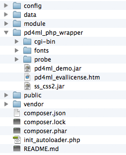
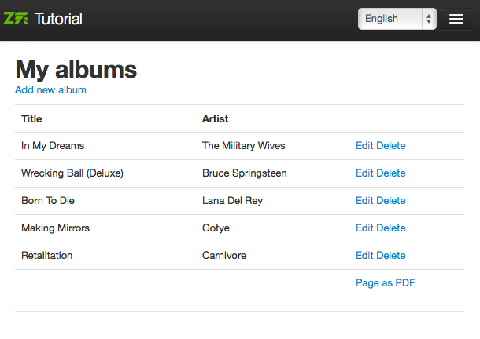

# Using PD4ML with Zend Framework 2 (ZF2)

This walkthrough adds a "Page as PDF" button to a Zend Framework 2 view, using the Zend Framework tutorial's own **Albums** sample application as the base. It builds directly on the [PHP Wrapper](php-wrapper.md) pattern -- shelling out to the `Pd4Cmd` command-line tool from a small PHP script -- so it's worth reading that page first if the general approach is unfamiliar.


This page was checked against the current PD4ML source before republishing, not just carried over. The Zend Framework 2 side of the walkthrough (the controller action, the view template, the module config) is unchanged, since none of that depends on PD4ML internals. What did need correcting is the `Pd4Cmd` invocation itself:

The original sample invokes it as `java ... -cp $jar Pd4Cmd ...` -- a bare, unqualified `Pd4Cmd` class name. That hasn't resolved for some time: `Pd4Cmd` lives in the `com.pd4ml.tools` package, not the default package, so a plain classpath launch needs the fully-qualified name. The packaged jar's manifest already declares `com.pd4ml.tools.Pd4Cmd` as its `Main-Class`, so the simplest fix -- and the form PD4ML's own command-line reference documents -- is to drop `-cp`/the class name entirely and launch the jar directly with `-jar`. Both PHP scripts below use the corrected form.


## Prerequisites

Follow the [Zend Framework 2 tutorial](http://framework.zend.com/manual/2.0/en/user-guide/overview.html) far enough to get the **Albums** demo application running.

Then set up PD4ML's PHP wrapper against that application, as described in [PHP Wrapper](php-wrapper.md): download the wrapper package, unpack it into the application root, confirm a Java runtime is reachable from PHP, and run the bundled environment probe script to confirm everything is wired up. The unpacked wrapper should sit alongside the ZF2 application like this:



## Adding a "Page as PDF" button to a view

The example adds a "Page as PDF" button to the album list. As a feature this is mostly illustrative -- in a real deployment, you'd typically point the PD4ML converter directly at a known, print-optimized report or invoice URL rather than working out the current page's URL through an HTTP referrer, as this example does for generality.

**1. Add a PDF-generation link to the album list view**, `module/Album/view/album/album/index.phtml`:

```html
...
</tr>
<?php endforeach; ?>
<!-- edit begin -->
<tr style="pd4ml-display: none">
<td>&nbsp;</td>
<td>&nbsp;</td>
<td>
<a href="<?php echo $this->url('album', array('action'=>'pdf'));?>">Page as PDF</a>
</td>
</tr>
<!-- edit end -->
</table>
```

(The added section sits between the `edit begin`/`edit end` comments.) The `pd4ml-display: none` style hides the link itself from the generated PDF -- confirmed still supported in the current PD4ML CSS engine -- since a self-referential "convert to PDF" link makes no sense inside its own PDF output.

With the link in place, the album list looks like this, pointing at a new, not-yet-handled `pdf` action:



**2. Add the `pdf` action handler** to `module/Album/src/Album/Controller/AlbumController.php`:

```php
public function pdfAction()
{
	$url = $this->getRequest()->getHeader('Referer')->getUri();
	$enc = base64_encode($url);
	$this->redirect()->toUrl($this->getRequest()->getBaseUrl() . '/pd4ml.php?url=' . $enc);
}
```

The handler reads the referring page's URL -- the album list, in this case -- and forwards it to the converter script as a `url` parameter, base64-encoding it to sidestep any issues with special characters.

**3. Create the converter script**, `public/pd4ml.php`, which the redirect above targets:

```php
<?php
$evaluation = 1;
$java = "java";

$url = base64_decode($_GET['url']) . '?layout=pdf';

if ( $evaluation == 1 ) {
	$jar = "../pd4ml_php_wrapper/pd4ml_demo.jar";
} else {
	$jar = "../pd4ml_php_wrapper/pd4ml.jar";
}

header("Pragma: cache");
header("Expires: 0");
header("Cache-control: private");
header('Content-type: application/pdf');
header('Content-disposition: inline');

if ( strpos(php_uname(), 'Windows' ) !== FALSE) {
	// server platform: Windows
	$jar = preg_replace('/\//', "\\\\", $jar);
	$cmdline = "$java -Xmx512m -jar $jar \"$url\" 800 A4";
} else {
	// server platform: UNIX-derived
	$cmdline = "$java -Xmx512m -Djava.awt.headless=true -jar $jar \"$url\" 800 A4";
}

// for the full current flag reference, see the Pd4Cmd Command-Line Reference page

passthru( $cmdline );

?>
```

Make sure there's no whitespace before `<?php` or after `?>`.

The script decodes the `url` parameter, converts that URL to a PDF via `Pd4Cmd`, and streams the resulting bytes back as the HTTP response. It also appends a `?layout=pdf` parameter to the URL before conversion, which the next step uses to signal the application to switch to a PDF-optimized layout.

**4. Add a PDF-optimized layout template.** The [original album list view](using-pd4ml-with-zend-framework-2-zf2.md#adding-a-page-as-pdf-button-to-a-view) includes a navigation bar, which belongs in an interactive web page but adds nothing useful to a printed/PDF document. Copy `module/Application/view/layout/layout.phtml` to `blank.phtml` in the same directory, and strip the navigation bar out:

```html
<?php echo $this->doctype(); ?>

<html lang="en">
<head>
<meta charset="utf-8">
<?php echo $this->headTitle('ZF2 '. $this->translate('Skeleton Application'))->setSeparator(' - ')->setAutoEscape(false) ?>

<?php echo $this->headMeta()->appendName('viewport', 'width=device-width, initial-scale=1.0') ?>

<!-- Le styles -->
<?php echo $this->headLink(array('rel' => 'shortcut icon', 'type' => 'image/vnd.microsoft.icon', 'href' => $this->basePath() . '/images/favicon.ico'))
->appendStylesheet($this->basePath() . '/css/bootstrap.min.css')
->appendStylesheet($this->basePath() . '/css/style.css')
->appendStylesheet($this->basePath() . '/css/bootstrap-responsive.min.css') ?>

<!-- Scripts -->
<?php echo $this->headScript()->appendFile($this->basePath() . '/js/html5.js', 'text/javascript', array('conditional' => 'lt IE 9',))
->appendFile($this->basePath() . '/js/jquery-1.7.2.min.js') ?>

</head>

<body>
<div class="container">
<br>
<?php echo $this->content; ?>
</div>
</body>
</html>
```

**5. Register the new template** in `module/Album/config/module.config.php`:

```js
'view_manager' => array(
	'template_path_stack' => array(
		'album' => __DIR__ . '/../view',
	),
),
// edit begin
'template_map' => array(
	'layout/blank' => __DIR__ . '/../view/layout/blank.phtml',
),
// edit end
```

**6. Switch templates based on the `layout` query parameter**, in `module/Album/src/Album/Controller/AlbumController.php`'s `index` action:

```js
public function indexAction()
{
	// edit begin
	$flag = $this->params()->fromQuery('layout');
	if ('pdf' == $flag) {
		$layout = $this->layout();
		$layout->setTemplate('layout/blank');
	}
	// edit end

	return new ViewModel(array(
		'albums' => $this->getAlbumTable()->fetchAll(),
	));
}
```

With all six steps in place, clicking "Page as PDF" produces a navigation-free PDF like [this example result](http://old.pd4ml.com/i/zend/pd4ml.php.pdf).

The complete application structure (excluding the PD4ML PHP wrapper itself, which is covered separately in [PHP Wrapper](php-wrapper.md)) is available as a [downloadable archive](http://old.pd4ml.com/i/zend/zf2.zip). Remember to adjust the database credentials in `config/autoload/local.php` before running it.

## See also

* [PHP Wrapper](php-wrapper.md) -- the general PD4ML-from-PHP pattern this walkthrough builds on, including deployment and troubleshooting notes.
* [Pd4Cmd Command-Line Reference](https://app.gitbook.com/s/33dI66uC6sTAcaPjppX2/pd4cmd-command-line-reference) -- the full, current flag reference for the `Pd4Cmd` invocation used by `pd4ml.php` above.
