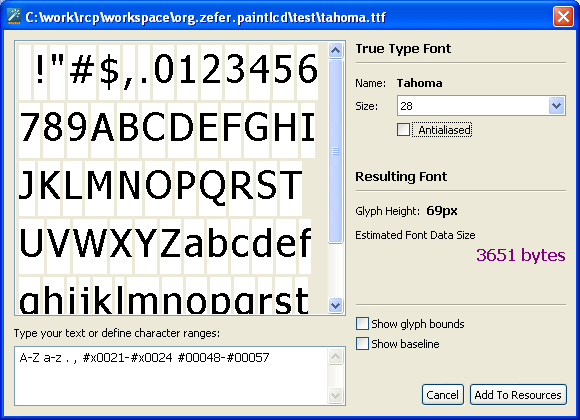
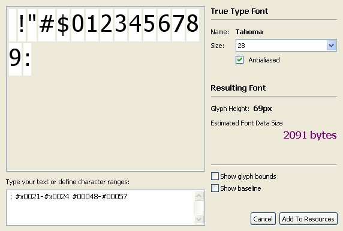
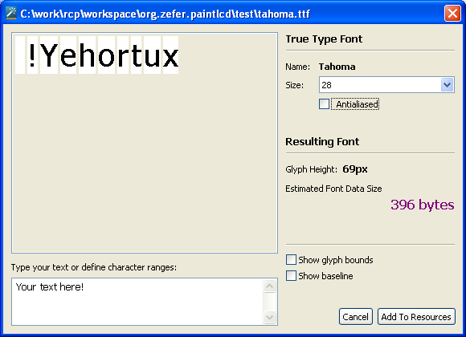
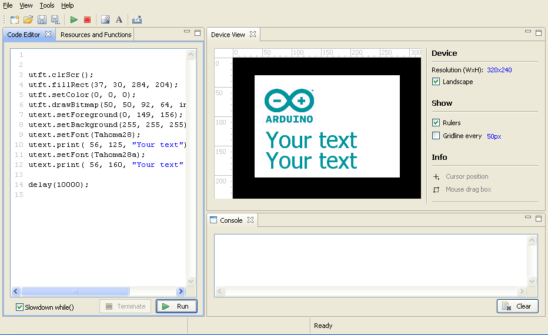
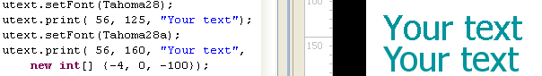

# Pixelmeister

## Features

### True Type Font Import

One of the defining features of `Pixelmeister` is the import of `TTF` fonts, which finally allows you to give your microelectronic device a professional-looking interface.

`Pixelmeister` converts `TTF` fonts into a compact bitmap format supported by the included `uText` library.

The format supports glyphs from both fixed-width fonts (e.g., `Courier`) and variable-width fonts (`Arial`, `Times New Roman`, etc.).

Fonts can be imported in "grainy" monochrome mode, which is convenient for `LCD` displays with their limitations. Fonts can also be imported in antialiased mode for smooth glyph borders on `TFT` displays.

The animated image below shows how the font size changes when antialiasing is turned on/off.

8 KB is likely too much for your target device's program memory. On the other hand, a 28-pixel font is too large for typical use and, say, only needed for displaying numeric data. Let's reduce the font's character range:

Well, it's now about 2 KB, which is significantly better. Furthermore, if you only need to use the font to output a single line, you can input it and generate a font containing only the characters used.

The animated image shows the resulting sizes of the grainy and antialiased font:

Once the font has been added to the resources, it can be referenced from the `uText library` and used to display text:

If you work with large fonts and are a perfectionist, you may need to adjust letter spacing in some cases. `uText` offers a way to change the default spacing using the kerning parameter of the `uText.print()` method.

The image shows the difference between grainy text without kerning and smooth text with kerning.

{-4, 0, -100} requests -4px kerning after the first character, 0px kerning after the second character, and -100 marks the end of the kerning data.

