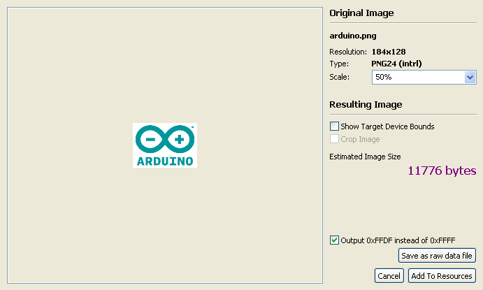
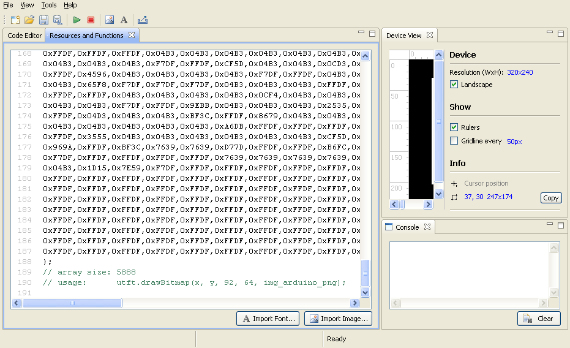
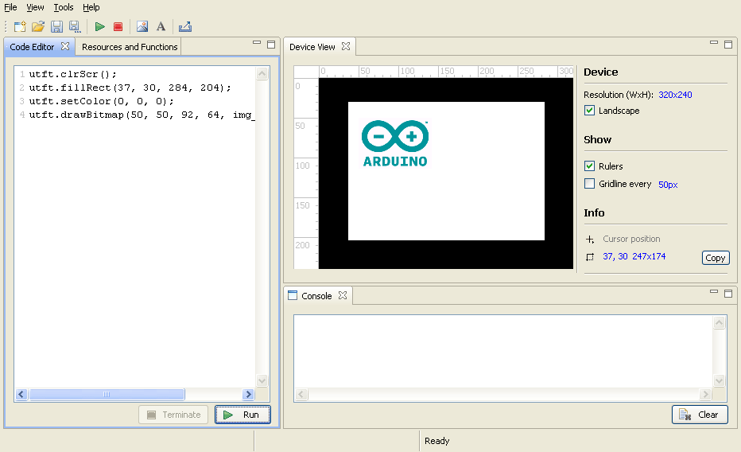

# Pixelmeister

## Tools

### Image import

`Pixelmeister` offers a powerful tool for importing images and converting them into `RGB565` bitmaps supported by the `UTFT` library and target devices.

This tool allows you to preview images, scale them, and check the expected output data sizes, which is always critical for resource-constrained microcontrollers.

The image data can either be saved in raw form to an external drive (e.g. for preloading from an `SD` card) or imported into the program's sketch resources (as `PROGMEM` data):

The generated data array is accompanied by a comment explaining the usage and indicating the data size (in bytes).

Here is the imported image, created using the API call from the sketch.

The image import dialog also includes an option to `Output 0xFFDF instead of 0xFFFF` which helps avoid occasional program loading errors. [More about...](MANUAL.md#avrdude-validation-error)

