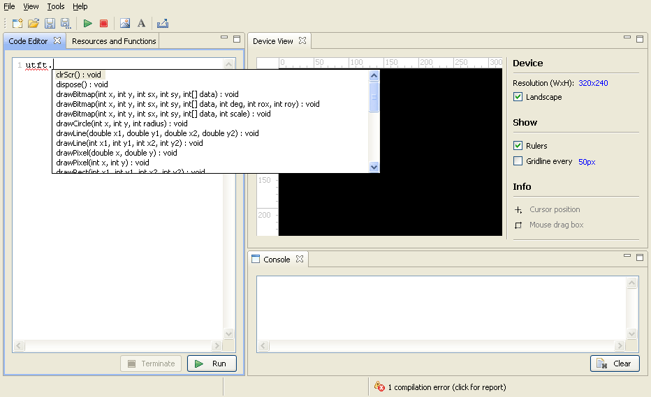
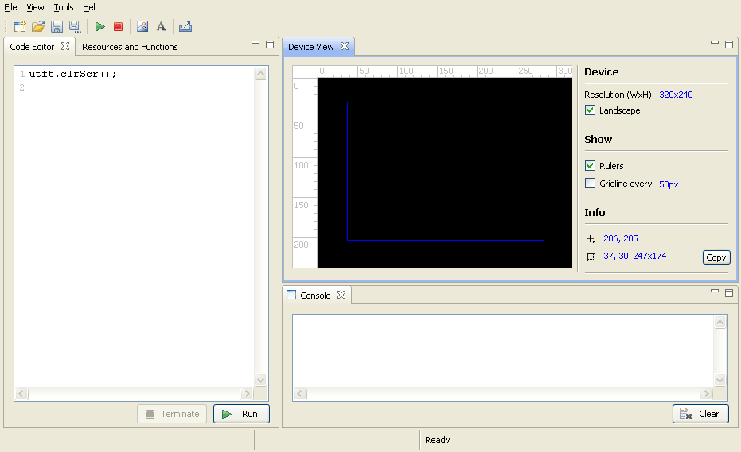
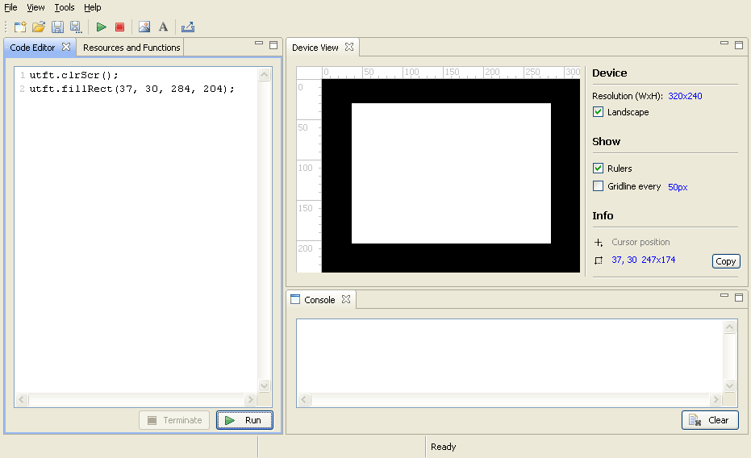
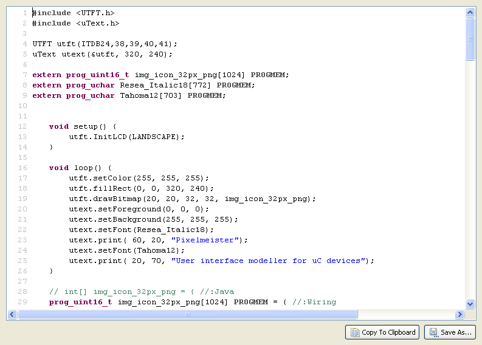
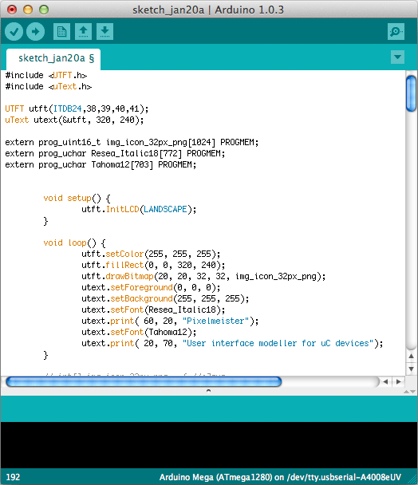
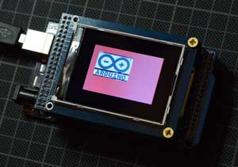
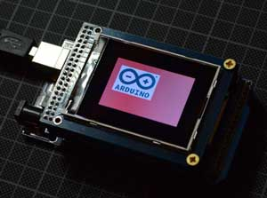

# Pixelmeister

## Features

Pixelmeister inherits the `Eclipse`/`SWT` application and GUI framework and supports basic features you're likely already familiar with. You can open and close individual views, combine them into groups, arrange groups in different areas of the application's main window, and collapse groups. If a view is closed by mistake, it can be reopened using the `Window` -> `Show View` menu command.

You can change the width and height of the target device and the grid spacing of the viewport by setting focus or clicking the edit buttons with blue text.

The code editor also implements a very simple content assist (autocompletion) feature. If a line of code begins with `pxs.`, `utft.`, or `utext.`, pressing `Ctrl-Space` will suggest API methods of the `Pixels`, `UTFT`, and `uText` classes, respectively, for insertion.



Pixelmeister precompiles any program code changes in memory and highlights any syntax errors:

Hovering the mouse over the error icon in the lower left corner displays a pop-up window with a compilation error message. Clicking the icon displays the error message in the console.

Please note: even though `Pixelmeister`'s programming language may look like `C++` or `Wiring`, it's actually `Java`. Since `Java` inherits its core language syntax from `C`/`C++`, you don't need to worry about this in most cases: you simply call methods of the `UTFT` or `uText` instance class; the syntax for `if-else`, `do-while`, `switch-case`, and so on is essentially the same. But, for example, when declaring an array, you'll need to create two versions and hide the `Wiring`-specific version from the `Java` compiler:

```
int[] kerning = { //:Java
//int8_t kerning[5] = { //:Wiring
-13,-15,-10,-3,-100 };
```

When exporting to Sketch, the above construct will automatically be converted to

```
//int[] kerning = { //:Java
int8_t kerning[5] = { //:Wiring
-13,-15,-10,-3,-100 };
```

The decision to change the code will be made based on an analysis of the `//:Java` and `//:Wiring` end comments.

The latest versions of Pixelmeister support the `#ifdef PIXELMEISTER`, `#else`, `#endif`, and `#ifndef PIXELMEISTER` preprocessor directives to simplify maintaining Sketch code across two platforms.

If you hover the mouse over the device's viewing area, you can see the actual mouse coordinates in the information panel. As you drag the cursor, a blue rectangle appears with coordinates and dimensions in `X`, `Y`, and `WIDTH x HEIGHT` format. You can set focus to the text label and copy and paste the values. However, the `UTFT` API methods expect rectangle coordinates in `X1`, `Y1`, `X2`, `Y2` format. You can get the rectangle coordinates in this format on the clipboard by clicking the `Copy` button.



Copying and pasting the rectangle coordinates into the parameters of utft.fillRect() produces the following result (as expected).



In uC programming, program sketch code is typically enclosed in the `do { ... } while( 1 )` construct.

This syntax is invalid for `Java`. If you replace it with the correct `do { ... } while( true )`, the code will compile, but at runtime it will consume all available system resources. This is acceptable for a microcontroller, but undesirable for the workstation running `Pixelmeister`.

The solution is to leave `do { ... } while( 1 )` as is. `Pixelmeister` will implicitly replace `while( 1 )` with the safe `while( slowWhile() )` construct. When exporting the sketch, `slowWhile()` will be replaced with `1`.

The sketch export functionality is straightforward. You can copy the sketch code (already preprocessed for maximum compatibility with `C++`/`Wiring`) to the clipboard or save it to your hard drive.



All that remains is to copy and paste it into the Arduino IDE, and the program will be ready to be compiled (with minor modifications if necessary) and downloaded to the target device.




## Tools

### Image import

[Read about the image import...](IMAGES.md)

### True Type Font Import

[Read about the font import...](FONTS.md)

## uText Library

<a name="utext"></a>

The current state of the library can be found at this link.
The library can be easily ported to any platform that supports horizontal and vertical line rendering.

### uText API

<table border="1" style="border-collapse: collapse" cellpadding=4 width="100%" id="table2">
	<tr>
		<th width="197"><font style="font-size: 12">Method</font></th>
		<th><font style="font-size: 12">Description</font></th>
		<th><font style="font-size: 12">Comments</font></th>
	</tr>
	<tr>
		<td valign="top" width="197"><font face="Courier New" size="2"><b>uText</b>(UTFT* utft, uint16_t width, uint16_t height);</font></td>
		<td valign="top">Constructor. Requires an reference to an instantiated 
		<a href="http://henningkarlsen.com/electronics/library.php?id=52">UTFT library</a> and target device width and height.</td>
		<td valign="top">&nbsp;</td>
	</tr>
	<tr>
		<td valign="top" width="197"><font face="Courier New" size="2">int <b>setFont</b>(prog_uchar font[]);</font></td>
		<td valign="top">Sets current font. The font must be in format, output 
		by Pixelmeister's Font Import tool.</td>
		<td valign="top">&nbsp;</td>
	</tr>
	<tr>
		<td valign="top" width="197"><font face="Courier New" size="2">void <b>setBackground</b>(uint8_t r, uint8_t g, uint8_t b);</font></td>
		<td valign="top">Sets text background.</td>
		<td valign="top">Text background is irrelevant for &quot;grainy&quot; fonts 
		output. For antialiased fonts the color is used to compute colors for 
		glyph edge smoothing.</td>
	</tr>
	<tr>
		<td valign="top" width="197"><font face="Courier New" size="2">void <b>setForeground</b>(uint8_t r, uint8_t g, uint8_t b);</font></td>
		<td valign="top">Set text foreground.</td>
		<td valign="top">&nbsp;</td>
	</tr>
	<tr>
		<td valign="top" width="197"><font face="Courier New" size="2">void <b>print</b>(int xx, int yy, String text, int8_t kerning[] = NULL);</font></td>
		<td valign="top">Prints a string by given coordinates. Optionally 
		accepts text kerning data.</td>
		<td valign="top">Kerning data in an integer array ends with -100 value. 
		Each value is to be applied after an characters located in string by the 
		same index. <br>
		<br>
		For example:<br>
		<b>int kerning[6] = { -3, 2, 0, -1, -100 };</b><br>
		applied to <b>&quot;kerning&quot;</b> string.<p>The default gap between 'k' and 
		'e' is going to be reduced to 3px, the gap between 'e' and 'r' extended 
		to 2px. Between 'r' and 'n' there is no kerning change. Between 'n' and 
		'i' it is going to be -1px. As the -1 value is the last in the sequence, 
		it will be applied to all gaps after 'i'. </td>
	</tr>
	<tr>
		<td valign="top" width="197"><font face="Courier New" size="2">void <b>clean</b>(int xx, int yy, String text, int8_t kerning[] = NULL);</font></td>
		<td valign="top">An opposite to text print method. Fills glyph shapes 
		with the background color. Optionally accepts text kerning data. Does 
		not impact pixels not belonging to a glyph.</td>
		<td valign="top">For 'grainy' fonts the method is probably redundant. 
		Its effect can be achieved by a a printing text over, painted to 
		background color. But with antialiased fonts it cares to fill with 
		opaque color also semi-transparent glyph edge pixels.</td>
	</tr>
	<tr>
		<td valign="top" width="197"><font face="Courier New" size="2">int16_t <b>getLineHeight</b>();</font></td>
		<td valign="top">Returns current font line height.</td>
		<td valign="top">&nbsp;</td>
	</tr>
	<tr>
		<td valign="top" width="197"><font face="Courier New" size="2">int16_t <b>getBaseline</b>();</font></td>
		<td valign="top">Returns current font baseline position.</td>
		<td valign="top">&nbsp;</td>
	</tr>
	<tr>
		<td valign="top" width="197"><font face="Courier New" size="2">int16_t <b>getTextWidth</b>(String text, int8_t kerning[] = NULL);</font></td>
		<td valign="top">Returns width in pixels of a particular text string, 
		printed with current font and (optionally) with given kerning info.</td>
		<td valign="top">&nbsp;</td>
	</tr>
</table>

## Troubleshooting

### Genaral instability.

*Windows:* Navigate to the application's home directory, open the `Pixelmeister.ini` file in a text editor, and change javaw in the second line to java. This change will launch Java with the console open. Check the console output for error messages or exception stack traces.

*Mac OS:* Open the Terminal application. Run:
```
cd /Applications/Pixelmeister.app/Contents/MacOS
./Pixelmeister -consoleLog
```

- After start the application closes. The Java console (if open) disappears too quickly to determine the cause of the error.
Most likely, the application does not have write access to the application's home directory. Change the directory permissions or owner using standard OS tools, or set Pixelmeister to "Run as administrator" (in the application's security properties).

<a name="avrdude-validation-error"></a>
- Sketch loading issue: `avrdude: validation error, first mismatch at byte 0xXXXX`
This issue typically occurs during program loading, when the program code contains relatively large data arrays with long sequences of 0xFF bytes (which is quite typical for programs that embed images with a white background). For some reason, avrdude "optimizes" the process of writing a chunk of data and skips loading the data (probably expecting the bytes to be in the default state of 0xFF).

After loading, the program reports a validation error, and during execution, the white areas of the loaded images appear corrupted:



The solution to preventing avddude from skipping data isn't obvious. As a workaround, we added the `Output 0xFFDF instead of 0xFFFF` option to the image import dialog, which sacrifices the least significant bit of the green channel to eliminate `0xFFFF` from the image data.



